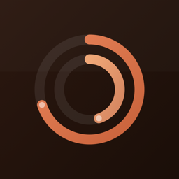
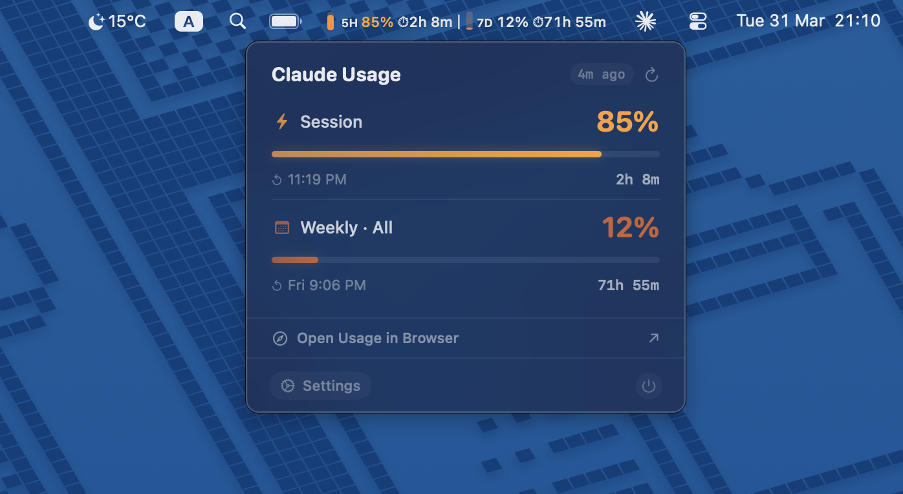

<p align="center">
  
</p>

<h1 align="center">CCStatsOSX</h1>

<p align="center">
  <strong>Claude usage stats in your macOS menu bar</strong><br>
  Monitor your Claude AI rate limits at a glance — across all services, no clicks needed.
</p>

<p align="center">
  <a href="https://github.com/uditalias/ccstatsosx/releases/download/v1.0.0/CCStatsOSX.dmg">
    
  </a>
</p>

<p align="center">
  
</p>

## What it does

Your Claude usage is shared across **all services** — Claude Code, claude.ai web, Desktop app, and Cowork. CCStatsOSX gives you one place to see it all without opening a browser.

It sits in your macOS menu bar and shows your usage in real-time:

- **5-hour session** utilization with countdown timer
- **7-day weekly** utilization across all models
- **Per-model breakdown** (Sonnet, Opus, Cowork) when available
- Color-coded warnings at configurable thresholds

Click the menu bar item to see a detailed breakdown, or just glance at the live percentages and timers. The data reflects your **total account usage** — whether you're chatting on the web, coding in Claude Code, or collaborating in Cowork.

## Requirements

- macOS 13 (Ventura) or later
- [Claude Code](https://claude.ai/code) installed and logged in (the app uses Claude Code's OAuth credentials)

## Install

Download the DMG, open it, and drag the app to `/Applications`. Or grab it from the [Releases](../../releases) page.

### Build from source

```bash
git clone https://github.com/uditalias/ccstatsosx.git
cd ccstatsosx
swift build -c release
./scripts/build-dmg.sh
```

The DMG will be at `.build/release/CCStatsOSX.dmg`.

## How it works

CCStatsOSX reads your Claude Code OAuth credentials from the macOS Keychain and polls the official usage API (`/api/oauth/usage`) — the same endpoint Claude Code's `/usage` command uses internally. This costs zero tokens and doesn't affect your rate limits.

**Data flow:**
1. Reads OAuth token from Keychain (same as Claude Code)
2. Calls `GET https://api.anthropic.com/api/oauth/usage` every 5 minutes (configurable)
3. Displays utilization percentages and reset timers in the menu bar
4. Countdown timers tick locally every second — always accurate between polls

**On first launch**, macOS will ask you to allow Keychain access to "Claude Code-credentials". Click **Always Allow** so it doesn't ask again.

## Features

### Menu bar display

Live usage data directly in the menu bar with three display modes:

| Mode | Example |
|------|---------|
| **Full** | `5H 45% 8:30 PM │ 7D 12% Fri 6:00 PM` |
| **Minimal** | `5H 45% 8:30 PM` |
| **Icon Only** | Mini progress bars only |

### Popover

Click the menu bar item for a detailed view with:
- Progress bars with animated fills
- Per-model breakdowns (Sonnet, Opus, Cowork)
- Reset countdowns
- Quick link to open Claude usage settings in browser

### Settings

Slide-in settings panel with:
- Display mode (Full / Minimal / Icon Only)
- Time format (Countdown or Date & Time)
- Visible categories toggle
- Polling interval (5m / 10m / 15m / 30m)
- Warning and critical thresholds
- Launch at login

### Notifications

macOS notifications when usage hits configurable thresholds:
- **Warning** at 70% (default)
- **Critical** at 90% (default)

### Keyboard shortcut

Press `⌘⇧U` from anywhere to toggle the popover.

### Right-click menu

Right-click the menu bar item for quick access to:
- Refresh Now
- Open Claude Usage Settings (in browser)
- Quit

## Configuration

All settings are stored in `UserDefaults` and configurable through the Settings panel in the app. Default values:

| Setting | Default |
|---------|---------|
| Poll interval | 5 minutes |
| Warning threshold | 70% |
| Critical threshold | 90% |
| Display mode | Full |
| Time format | Date & Time |
| Launch at login | Off |

## Privacy

CCStatsOSX:
- Reads Claude Code credentials **locally** from your macOS Keychain
- Calls **only** the Anthropic usage API (`/api/oauth/usage`)
- Stores settings in local `UserDefaults`
- **Never** sends data to any third party
- **Never** makes inference calls or consumes tokens
- Has **no analytics, telemetry, or tracking**

## License

MIT
